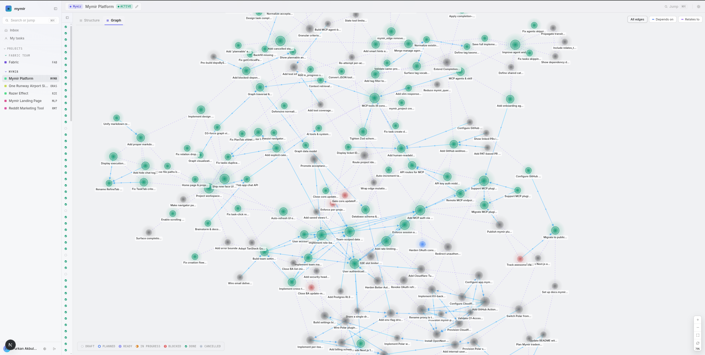

> Context management for the agent-native engineering era.

<p align="center">
  <a href="#claude-code"></a>
  &nbsp;&nbsp;
  <a href="#codex"></a>
  &nbsp;&nbsp;
  <a href="#cursor"></a>
  &nbsp;&nbsp;
  <a href="#gemini"></a>
</p>

<p align="center">
  
</p>

Most of us aren't really writing code anymore, we're directing agents that do. But those agents have no memory. Every session starts from zero, and engineers end up spending their time re-explaining what was built, why decisions were made, and what still needs to happen. That's not engineering, that's babysitting.

Mymir replaces that cycle. It's not just a context layer your agents read from, it's an end-to-end project management tool that agents operate natively. Mymir creates tasks, refines them, plans implementations, provides the right context at the right stage, and tracks everything that happens. Your agent harness doesn't need a briefing. It walks into every session knowing exactly what to do next and why.

---

## How to set it up

You need [Bun](https://bun.sh) (v1.0+) and [Docker](https://docs.docker.com/get-docker/) for PostgreSQL.

Clone the repo and install dependencies:

```bash
git clone git@github.com:FrkAk/mymir.git
cd mymir
bun install
cp .env.local.example .env.local
```

**Bring your own coding agent.** Mymir works directly inside the coding agent you already use: Claude Code, Codex, Cursor, or Gemini CLI. Brainstorm, decompose, and project activation happen there. The web app is for refining specs, planning, and tracking progress on `active` projects from the browser.

Add your credentials to `.env.local` (see `.env.local.example` for the full list). Mymir uses three Postgres roles for defense-in-depth — generate three passwords and wire them into three URLs:

```bash
# Generate three passwords:
#   export APP_USER_PASSWORD=$(openssl rand -base64 24)
#   export SERVICE_ROLE_PASSWORD=$(openssl rand -base64 24)
#   export AUTH_ROLE_PASSWORD=$(openssl rand -base64 24)

APP_USER_PASSWORD=replace-with-openssl-rand-base64-24
SERVICE_ROLE_PASSWORD=replace-with-openssl-rand-base64-24
AUTH_ROLE_PASSWORD=replace-with-openssl-rand-base64-24

DATABASE_URL=postgresql://app_user:<APP_USER_PASSWORD>@localhost:5432/mymir
DATABASE_SERVICE_ROLE_URL=postgresql://service_role:<SERVICE_ROLE_PASSWORD>@localhost:5432/mymir
DATABASE_AUTH_URL=postgresql://auth_role:<AUTH_ROLE_PASSWORD>@localhost:5432/mymir

# Better Auth: session secret (openssl rand -base64 32) and callback origin
BETTER_AUTH_SECRET=generate-a-random-secret-at-least-32-chars
BETTER_AUTH_URL=http://localhost:3000
```

See the "Security model" section below for what each role does.

Spin up Postgres and push the schema:

```bash
bun run db:setup
```

Build and start the server and open [localhost:3000](http://localhost:3000):

```bash
bun run build
bun run start
```

Mymir ships as four standalone plugin/extension dirs, one per supported CLI under `plugins/<cli>/`. With the dev server running, install the one that matches your tool.

### Claude Code

```bash
claude plugin marketplace add ./plugins/claude-code
claude plugin install mymir@mymir-local
```

Authenticate with `/mcp`, select **mymir**, and complete the browser sign-in (once per machine).

Update with `claude plugin update mymir@mymir-local` and restart Claude Code. MCP server changes (`lib/mcp/`) apply immediately without an update.

### Codex

```bash
codex plugin marketplace add ./plugins
```

Open Codex, run `/plugin`, search for **Mymir**, install, then restart. Invoke the main skill explicitly with `$mymir` when needed.

### Gemini

```bash
gemini extensions install ./plugins/gemini
```

Authenticate with `/mcp auth mymir` and complete the browser sign-in.

Update with `gemini extensions update mymir`; remove with `gemini extensions uninstall mymir`.

### Cursor

```bash
ln -s "$(pwd)/plugins/cursor" ~/.cursor/plugins/local/mymir
```

Restart Cursor (or run **Developer: Reload Window**). The MCP server and five skills (`mymir`, `brainstorm`, `decompose`, `manage`, `onboarding`) load automatically. First MCP tool call triggers OAuth in your browser. Trigger a skill with `/mymir`, `/brainstorm`, etc., or let the agent auto-invoke based on your prompt.

Self-hosted: edit `plugins/cursor/mcp.json` to point at your deployment URL before symlinking.

### What gets installed

All four plugins bundle the shared components:

| Component | What it does |
| --- | --- |
| **6 MCP tools** | `mymir_project`, `mymir_task`, `mymir_edge`, `mymir_query`, `mymir_context`, `mymir_analyze` |
| **`/mymir` skill** | Auto-invokes when conversation matches project planning; routes to inline workflows or hands off to a deep-mode workflow when needed |
| **Brainstorm workflow** | Explore and shape a project idea through structured conversation |
| **Onboarding workflow** | Reverse-engineer an existing codebase into a task graph with shipped work recorded as `done` |
| **Decompose workflow** | Break a project brief into a dependency graph |
| **Manage workflow** | Strategic CTO-mode review: rebalance the graph, audit dependencies, prune orphans, consolidate categories |

In Codex, Cursor, and Gemini each workflow is a skill invoked by slash command. In Claude Code each is also available as a dispatchable agent (via the Task tool) so the main `/mymir` skill can hand off work in a clean per-agent context.

**Claude Code additionally bundles:**

| Component | What it does |
| --- | --- |
| **`/mymir:composer` skill** | End-to-end task orchestrator. Picks the highest-value ready task (or one named ref), drives it through research → plan → implement → propagate via three dispatched subagents per task in clean per-phase contexts, loops until queue empty or user stops. Requires `/goal` harness for backlog mode (composer emits it on first turn; user pastes). |
| **Composer subagents** | `mymir:composer-researcher` gathers grounded context and refines the task; `mymir:composer-planner` writes the unabridged implementation plan; `mymir:composer-implementer` ships the code, opens a PR, and marks the task done. |
| **`mymir:decompose-task` agent** | Splits an existing oversize task in an active project into 2 to N children, rewires every dependency edge touching the parent, cancels the parent with rationale citing the children. Composer's oversize handler routes here. |
| **`mymir:decompose-feature` agent** | Adds a new feature or capability cluster to an active project. Reuses existing categories and tag vocabulary; creates 5 to 20 tasks plus internal and integration edges. |

(Composer depends on a subagent dispatch primitive for clean per-phase contexts and tool-restriction enforcement. Codex, Cursor, and Gemini do not yet have an equivalent, so composer is Claude Code only for now.)

---

## How it runs

Mymir ships as a Next.js web app plus vendor-native plugins for Claude Code, Codex, Cursor, and Gemini. Each plugin bundles 6 MCP tools, the four core workflows (brainstorm, onboarding, decompose, manage), and a `/mymir` skill that auto-invokes when you talk about projects, tasks, or planning. Claude Code adds end-to-end task orchestration via `/mymir:composer` plus `decompose-task` and `decompose-feature` for surgical decomposition within active projects. You don't call tools manually, you just talk.

**Three entry paths, one graph.**

*No project yet.* The brainstorm agent shapes the idea with you, then decompose breaks it into a task graph:

```text
❯ I want to build a real-time dashboard for server metrics
```

*Existing codebase, no tracking yet.* Onboarding reverse-engineers a graph from the code and git history, gated on your approval before anything is written:

```text
❯ Onboard this existing codebase
```

*Ongoing project.* The `/mymir` skill detects the repo and picks up where you left off:

```text
❯ What's the status of the project?
```

**Skip the context briefing.** Name a task or ask what's next. Mymir delivers the right bundle for that task's state, so you don't write "here's what you need to know" prompts yourself:

```text
❯ What should I work on next?
❯ Plan and implement MYMR-101
```

**Add and refine mid-flow.** Spot something missing, describe it, and push back until it's right:

```text
❯ Add a task for an onboarding agent that records shipped work as done tasks. Relate it to the codex/gemini support task.
```

```text
❯ Priority is urgent, draft ACs are enough, and monorepo detection should ask the user.
```

**Drive end-to-end (Claude Code).** Once a project is active and tasks are ready, composer can take over. Pick the next task off the critical path, research it in context, plan it, implement it, open the PR, propagate the result, and loop:

```text
❯ /mymir:composer
```

Or take one specific task all the way to a PR:

```text
❯ /mymir:composer MYMR-101
```

Composer dispatches three subagents per task in clean per-phase contexts (researcher → planner → implementer). The orchestrator stays out of the work itself and only picks tasks, hands off, and propagates.

**Tune in the UI.** Inspect edges, read execution records, and edit descriptions, ACs, tags, or dependencies directly. The agent loop and the UI write to the same store, so edits land by the next tool call.

---

## Security model

Mymir uses three Postgres roles plus Row-Level Security so a compromise of the app cannot leak data beyond what RLS allows.

**`app_user`** (NOBYPASSRLS) — every web request connects through this role via `DATABASE_URL`. RLS policies on all 8 public-schema tables (`projects`, `tasks`, `task_edges`, `task_acceptance_criteria`, `task_decisions`, `task_links`, `task_assignees`, `team_invite_code`) enforce team isolation by joining `neon_auth.member` on `current_setting('app.user_id', TRUE)`. The data ring opens a `withUserContext(userId, …)` transaction before every query, setting the GUC so the policy resolves.

`app_user` is deliberately starved on `neon_auth.*` — it has SELECT on `member`, `organization`, `user`, `invitation` only. It has NO grants on `account` (password hashes), `session` (session tokens), `verification` (codes), `oauthClient*` (client secrets), `oauthAccessToken`/`oauthRefreshToken` (OAuth tokens), or `jwks` (JWT private keys).

**`auth_role`** — Better Auth's connection, via `DATABASE_AUTH_URL`. Full DML on `neon_auth.*`, no grants on `public.*`. A compromise of `auth_role` cannot read or write app data.

**`service_role`** (BYPASSRLS) — migrations (`drizzle-kit push`) and a small set of documented runtime bypass sites enumerated on `lib/db/connection.ts` (cross-schema artifact cleanup, admin-only project/membership lookups for BA `afterRemoveMember` / `beforeDeleteOrganization` hooks, and non-tenant-scoped OAuth artifact reads). Wired via `DATABASE_SERVICE_ROLE_URL`. The data ring never opens a BYPASSRLS connection for the team-invite-code flow — those moved to `SECURITY DEFINER` SQL functions exposed to `app_user`.

**The blast radius** of a successful SQL injection or logic bug under `app_user` is bounded by:
- The policies in `docker/rls-policies.sql` (joins `neon_auth.member` on the GUC).
- The `SECURITY DEFINER` function bodies in `docker/rls-functions.sql` (each pins `search_path` ending in `pg_temp`, is `EXECUTE`-restricted to `app_user` or `service_role`, and re-asserts org scope inside its body).
- No access to any auth secret (password hashes, OAuth tokens, JWT keys, session tokens).

ESLint forbids bare `db.transaction(...)` outside `lib/db/rls.ts` and the two documented exempt files, so future code can't accidentally open a raw transaction that skips the GUC.

A regression test gate (`bun run test:rls`) runs the full test suite with `DATABASE_URL` pointed at `app_user`, ensuring any new bare-`db` read trips a red test.

---

## How it works

Instead of docs, wikis, or messy markdown files, Mymir treats project context as a live knowledge base agents can reason from.

We built Mymir around two core concepts:

**Context network.** A living map of your project that captures not just what was built, but why decisions were made, what was tried and abandoned, and how different parts of the codebase relate to each other.

**Context retrieval interface.** Four context shapes, one per job. Each is arranged by U-shaped attention (highest-recall content at the start and end) so what matters most lands where LLMs read best:

| Shape | For | What's in it |
| --- | --- | --- |
| `summary` | Quick lookup | Title, status, edge counts |
| `working` | Refining or reviewing a task | Criteria, decisions, 1-hop neighbors |
| `planning` | Writing an implementation plan | Project brief, prerequisites, upstream execution records, downstream specs |
| `agent` | Coding the task | Implementation plan, multi-hop upstream execution records, file paths, acceptance criteria |

Together, they don't just inform your agent, they drive it. Mymir manages the full lifecycle: **Brainstorm > Decompose > Refine > Plan > Execute > Track**.

Describe your idea and Mymir decomposes it into tasks with dependency edges, determines what's ready to plan or implement, and hands your agent the exact context it needs for that stage. When a task is plannable, your agent gets the spec, prerequisites, and related work. When it's ready to implement, your agent gets the full execution context: upstream decisions, file paths, and acceptance criteria.

The agent moves from task to task with the right context at every step, no manual handoff required.

*We're building Mymir using Mymir, so everything described here is something we're living in real time.*

---

## How it looks

The web UI has two modes: **Structure** and **Graph**.

Structure mode puts your task list on the left and a detail panel on the right. You refine specs, track progress, and review execution records without switching views.


Graph mode overlays the context network so you can see how tasks, decisions, and dependencies connect while still working in the detail panel.


Zoom out and the full graph renders your entire context network. Clusters, bottlenecks, and orphaned work become obvious at a glance.



---

## What's coming

We're working on a hosted version for those who want the full experience without the setup. Run from anywhere, access your team's projects, collaborate across sessions. Privacy is a core value, which is why it's taking longer than usual to get right.

The hosted version will be a paid service. We can't bear the infrastructure costs on our own, and we'd rather be upfront about that than pretend otherwise. Self-hosted remains free and always will.

---

## Why open source

We believe everyone should have access to tools that help them build better things. Open source is how we make that real.

It also means we ship faster. Community contributions, bug reports, and ideas make Mymir better for everyone. If you care about better infrastructure for agent-driven development, come build with us.

---

## Stack

Next.js 16, TypeScript 6, React 19, PostgreSQL, Drizzle ORM, Tailwind CSS v4, Motion

---

## Stargazers

<a href="https://www.star-history.com/?repos=FrkAk%2Fmymir&type=date&legend=top-left">
 <picture>
   <source media="(prefers-color-scheme: dark)" srcset="https://api.star-history.com/chart?repos=FrkAk/mymir&type=date&theme=dark&legend=top-left" />
   <source media="(prefers-color-scheme: light)" srcset="https://api.star-history.com/chart?repos=FrkAk/mymir&type=date&legend=top-left" />
   
 </picture>
</a>

---

## Contributing

See [CONTRIBUTING.md](CONTRIBUTING.md) for setup instructions and PR guidelines.

## License

Mymir is licensed under [AGPL-3.0](LICENSE). A commercial license is also available, see [LICENSING.md](LICENSING.md) for details.
